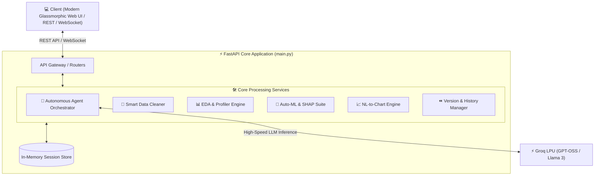

<div align="center">

# ⚡ AI Data Cleaning Studio & Autonomous Agent 🚀

### *The Next-Generation AI-Powered Data Analysis, Automated Cleaning, Auto-ML & Autonomous Agent Platform*

[](https://fastapi.tiangolo.com)
[](https://www.python.org/)
[](https://groq.com/)
[](https://scikit-learn.org/)
[](https://xgboost.readthedocs.io/)
[](https://opensource.org/licenses/MIT)

<p align="center">
  <a href="#-key-features">Key Features</a> •
  <a href="#-architecture">Architecture</a> •
  <a href="#-tech-stack">Tech Stack</a> •
  <a href="#-quick-start">Quick Start</a> •
  <a href="#-api-endpoints">API Reference</a> •
  <a href="#-deployment-guide">Deployment</a>
</p>

---

</div>

## 🌟 Overview

**AI Data Cleaning Studio** is an enterprise-grade, end-to-end intelligent data studio that combines autonomous LLM agents with automated data engineering and machine learning workflows. 

Whether you're dealing with messy CSVs, noisy Excel spreadsheets, or preparing data for production machine learning pipelines, **AI Data Studio** handles everything: from exploratory data analysis (EDA), automated cleaning, and anomaly detection to model training, SHAP explainability, and natural language chart generation.

---

## ✨ Key Features

### 🤖 1. Autonomous AI Agent (Powered by Groq LLMs)
- **Multi-Step Execution & Planning**: Describe goals in plain English (e.g., *"Handle missing values in age, remove outliers, and train a model to predict churn"*).
- **Interactive WebSockets**: Real-time streaming status updates, step-by-step telemetry, and immediate rollbacks.
- **Agent Tool Execution**: Full access to cleaning, profiling, feature transformation, and modeling tools with self-correcting validation.

### 🧹 2. Smart Automated Data Cleaning
- **Intelligent Imputation**: Mean, median, mode, KNN, and iterative forward/backward fill based on column distribution.
- **Outlier Detection & Capping**: IQR (Interquartile Range) and Z-Score filtering with automatic boundary capping.
- **Duplicate & Type Handling**: Strict & fuzzy deduplication, smart type inference (dates, booleans, numerical categories).

### 📊 3. Advanced Exploratory Data Analysis & Profiling
- **Comprehensive Data Profiler**: Correlation matrices, skewness, kurtosis, missingness maps, and cardinality detection.
- **Data Quality Scoring**: Holistic quality scoring measuring completeness, uniqueness, consistency, and validity.
- **Smart Recommendations**: Rule-based & heuristic recommendations for dataset optimization.

### 🧠 4. Auto-ML & Explainable AI (XAI)
- **Model Training Suite**: Trains and compares multiple algorithms (`RandomForest`, `XGBoost`, `LightGBM`, `CatBoost`, `Logistic Regression`).
- **Hyperparameter Tuning**: Optuna-powered automated Bayesian optimization.
- **SHAP Feature Importance**: Generates SHAP summary plots and global feature attribution graphs.

### 📈 5. Natural Language to Visualizations (NL-to-Chart)
- Prompt-based chart creation: *"Show me the distribution of salary across departments as a bar chart"*.
- Built-in automatic aggregations, responsive Chart.js rendering, and vibrant curated palettes.

### ⏪ 6. Version Control & Checkpoints
- **Dataset Git**: Create dataset snapshot versions after each transformation.
- **Instant Rollback & Diff Viewer**: Compare modifications line-by-line and revert any step seamlessly.

---

## 🏛️ System Architecture



---

## 🛠️ Tech Stack

| Domain | Technologies & Libraries |
| :--- | :--- |
| **Backend Framework** | [FastAPI](https://fastapi.tiangolo.com/), [Uvicorn](https://www.uvicorn.org/), [Pydantic v2](https://docs.pydantic.dev/) |
| **AI / LLM Inference** | [Groq SDK](https://github.com/groq/groq-python), [OpenAI-compatible endpoints](https://groq.com) |
| **Data Processing** | [Pandas](https://pandas.pydata.org/), [NumPy](https://numpy.org/), [OpenPyXL](https://openpyxl.readthedocs.io/), [PyArrow](https://arrow.apache.org/) |
| **Machine Learning & AI** | [Scikit-Learn](https://scikit-learn.org/), [XGBoost](https://xgboost.readthedocs.io/), [LightGBM](https://lightgbm.readthedocs.io/), [CatBoost](https://catboost.ai/), [SHAP](https://shap.readthedocs.io/), [Optuna](https://optuna.org/), [Imbalanced-Learn](https://imbalanced-learn.org/) |
| **Frontend UI** | HTML5, CSS3 Glassmorphism Design System, Vanilla JavaScript, Chart.js, WebSockets |
| **Deployment Ready** | Docker, Render, Microsoft Azure App Service, Railway, Fly.io |

---

## 📂 Project Structure

```text
├── .gitignore               # Comprehensive Git ignore rules
├── .env.example             # Template for required environment variables
├── requirements.txt         # Root dependency list for production
├── render.yaml              # Render.com Blueprint deployment file
├── main.py                  # Root application entrypoint & bridge
└── new_/
    ├── config/              # Application settings & environment loader
    ├── frontend/            # Glassmorphism dark-mode UI (index.html)
    ├── main.py              # FastAPI app instance with routers & middleware
    ├── models/              # Pydantic request & response schemas
    ├── requirements.txt     # Subfolder dependency definitions
    ├── routers/             # Modular API endpoints (Clean, ML, Agent, etc.)
    │   ├── agent_router.py  # WebSocket & REST endpoints for the AI Agent
    │   ├── analyze.py       # Data analysis endpoints
    │   ├── anomalies.py     # Anomaly detection endpoints
    │   ├── clean.py         # Data cleaning endpoints
    │   ├── export.py        # CSV/Excel export endpoints
    │   ├── ml_model.py      # ML training & inference endpoints
    │   ├── profiler.py      # Data profiling endpoints
    │   ├── quality.py       # Quality score calculation endpoints
    │   ├── recommendations.py # Smart recommendations endpoints
    │   ├── transform.py     # Feature engineering endpoints
    │   ├── upload.py        # File upload endpoints
    │   └── versions.py      # Dataset checkpoint & rollback endpoints
    ├── services/            # Core business logic & algorithms
    └── tests/               # Comprehensive unit & integration tests
```

---

## 🚀 Quick Start (Local Setup)

### 1. Clone the Repository
```bash
git clone https://github.com/MR-Zain-Asif/AI-Data-Studio.git
cd AI-Data-Studio
```

### 2. Create and Activate a Virtual Environment
```bash
# Windows
python -m venv venv
.\venv\Scripts\activate

# Linux / macOS
python3 -m venv venv
source venv/bin/activate
```

### 3. Install Dependencies
```bash
pip install -r requirements.txt
```

### 4. Configure Environment Variables
Create a `.env` file in the root folder (or copy from `.env.example`):
```env
GROQ_API_KEY=your_groq_api_key_here
```
> 💡 *Get a free, ultra-fast API key at [console.groq.com](https://console.groq.com)*.

### 5. Launch the Studio
```bash
python main.py
```
Open your browser and navigate to:
- **Interactive UI**: `http://localhost:8000/`
- **Swagger API Docs**: `http://localhost:8000/docs`
- **Health Check**: `http://localhost:8000/health`

---

## 📡 API Reference Overview

| Endpoint | Method | Description |
| :--- | :---: | :--- |
| `/health` | `GET` | Service liveness & health check |
| `/api/upload` | `POST` | Upload CSV/Excel dataset and initialize session |
| `/api/analyze` | `GET` | Generate statistical overview, column types, & distributions |
| `/api/quality` | `GET` | Calculate comprehensive dataset quality index |
| `/api/clean/missing` | `POST` | Smart missing value imputation |
| `/api/clean/outliers` | `POST` | Detect & treat outliers with IQR/Z-Score |
| `/api/anomalies/detect` | `POST` | Run Isolation Forest / LOF anomaly detection |
| `/api/ml/train` | `POST` | Auto-train classification/regression models with SHAP |
| `/api/agent/chat` | `POST` | Execute plain language instructions via AI Agent |
| `/api/agent/ws/{session_id}` | `WS` | Real-time bidirectional WebSocket stream for Agent |
| `/api/versions/rollback` | `POST` | Rollback dataset to a previous version checkpoint |

---

## 📄 License

This project is licensed under the **MIT License** — see the [LICENSE](LICENSE) file for details.

---

<div align="center">
  <b>Built with ❤️ by <a href="https://github.com/MR-Zain-Asif">MR-Zain-Asif</a></b>
</div>
